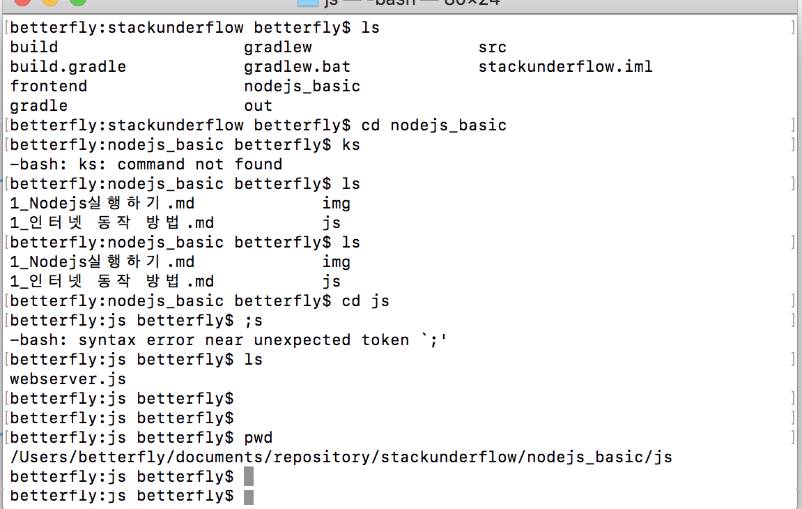
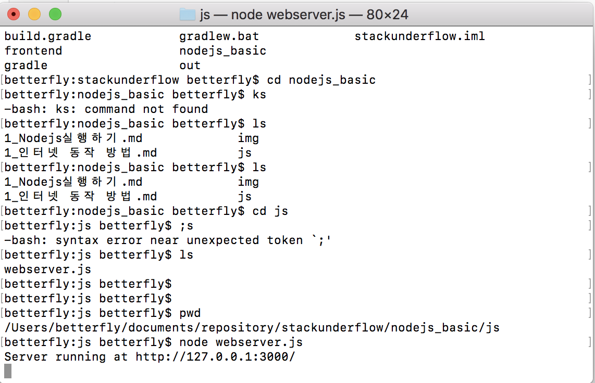
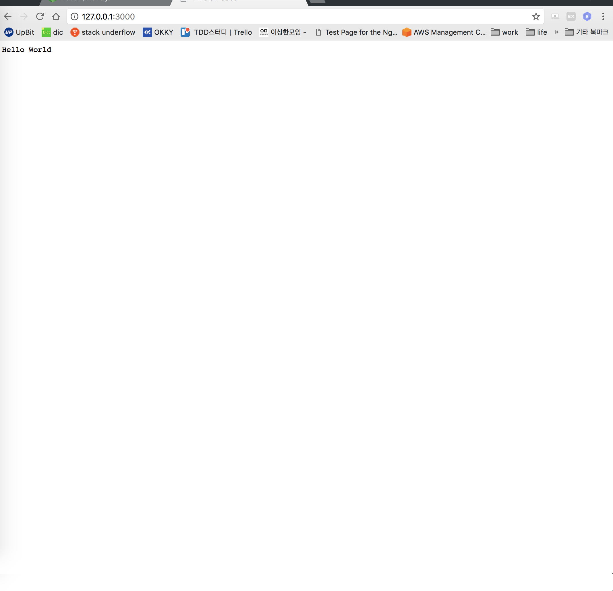

<h1> Node.js 간단한 웹app 만들어보기 </h1>

그리고 Node.js 공식 홈페이지에 나와있는 기본 접속 테스트 코드의 js 파일을 생성한다.

const http = require('http');

const hostname = '127.0.0.1';
const port = 3000;

const server = http.createServer((req, res) => {
    res.statusCode = 200;
res.setHeader('Content-Type', 'text/plain');
res.end('Hello World\n');
});

server.listen(port, hostname, () => {
    console.log(`Server running at http://${hostname}:${port}/`);
});

Terminal을 실행하여 js파일이 위치한 디렉토리로 이동한다

그리고 해당 js 파일을 node.js를 통해 실행한다.

웹 브라우저에서도 실행해본다

