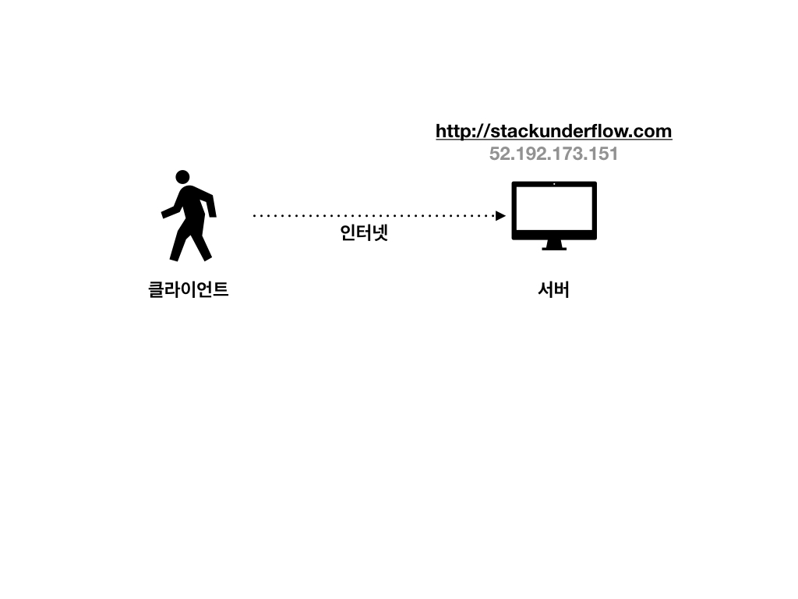
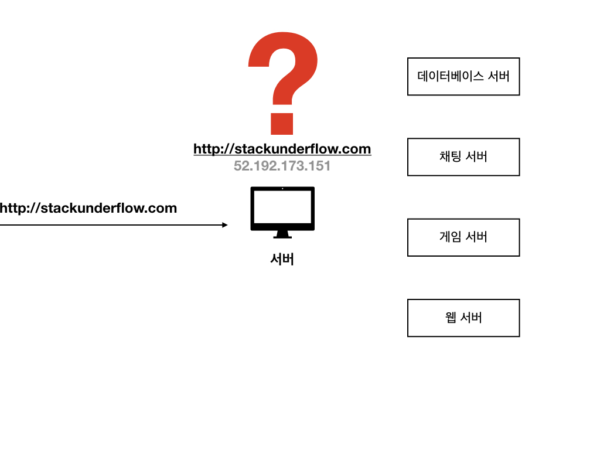
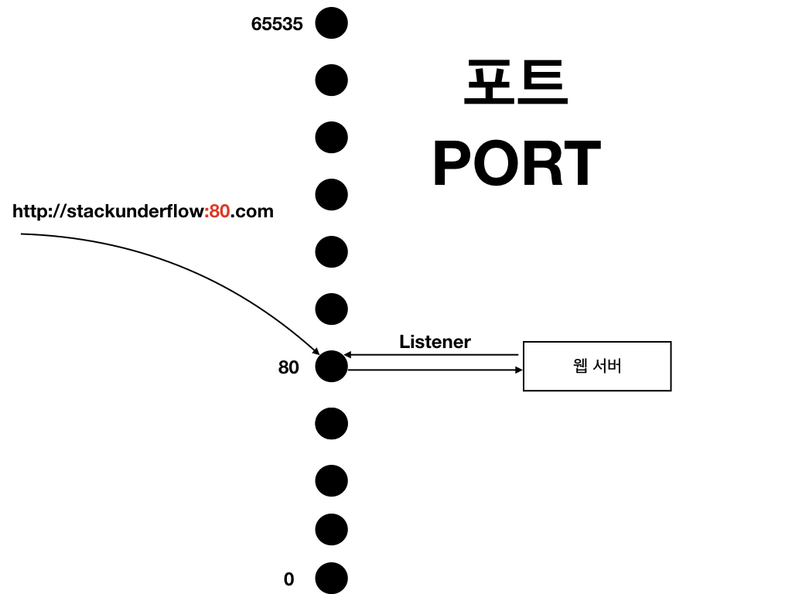

<h1> 인터넷의 동작 방법</h1>

컴퓨터 각각은 서로 독립적이었지만, 인터넷이 등장하며 협력적인 활동을 할 수 있게된 것은 가장 혁명적인 일 중 하나였다.
인터넷을 이해하기 위해선 '클라이언트' 그리고 '서버'를 알아야 한다.
인터넷은 반드시 클라이언트(요청) - 서버(응답) 의 개념이 필요하다.
웹 브라우저 (클라이언트) <> 웹 브라우저의 응답을 처리하는 곳 (서버)

서버는 도메인 주소를 갖고 있는데,
이것은 사람이 이해하기 쉽게 보여지는 곳이고,
실제로 서버는 아이피(IP Address)에 접속하여 해당 서버에 접속한다.

하나의 서버 컴퓨터 안에는 누가 어떻게 응답할지 고민해봐야한다.
컴퓨터는 0 ~ 65535 개의 입장공간이 있다. 이를 PORT라고 한다.
PORT는 항구인데, 배가 정박하는 것과 비슷한 개념으로 생각하면 될 것 같다.

우리는 이 중 80번 포트에다가 웹서버를 실행시킨다면,
즉 웹서버를 실행하여 80번 포트에 연결을 한다는 것은 다시 말해, 웹서버가 80번 포트를 바라 본다는 것이다.
이를 정확히 표현한다면 '80번포트를 리스닝 한다'

이후 사용자가 해당 서버에 접속할 때,
ex) http://a.com:80

이와 같은 요청이 있다면, 클라이언트는 서버에게 80번 포트와 연결하고 싶다는 '요청'을 보낸 것이다.
그러면, 그 서버 컴퓨터는 80번 포트를 연결해주기 때문에
80번 포트와 연결되어있는 (80번 포트를 리스닝하고 있는) 웹서버를 호출하여 응답을 처리할 수 있게 된다.

하지만 아주 성공적인 웹 환경상 매번 80이라는 포트를 기입하는 번거로움을 탈피할 수 있어,
http://a.com 까지의 도메인만 입력해도 요청이 가능하다.
서버는 http를 통해 웹브라우저를 통해 접속했다는 것을 인지할 수 있으므로 80번 포트의 웹서버와 연결해줄 수 있다.

80번 포트를 적지 않고 처리가 가능한 것은 서버와 클라이언트간의 약속이다.

그렇다면 만약 1337 이라는 포트를 지정하여 이와 같은 처리가 가능할까?
물론이다.
웹 서버상에서 1337라는 포트를 리스닝한다면, 동일한 처리가 가능하다.

