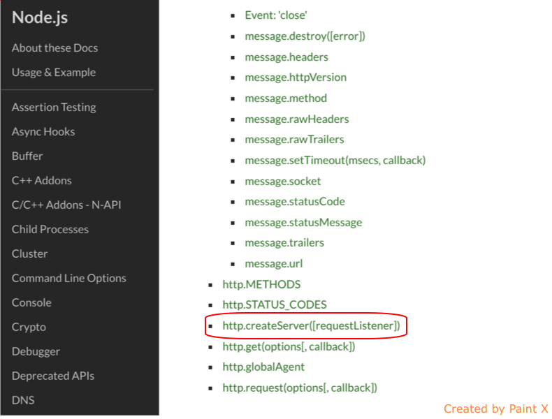
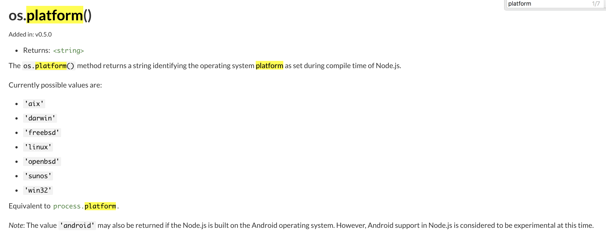

<h1>모듈_기초</h1>

모듈은 소프트웨어의 '부품' 이라는 개념

```javascript
const http = require('http');


const hostname = '127.0.0.1';
const port = 3000;


const server = http.createServer((req, res) => {
    res.statusCode = 200;
res.setHeader('Content-Type', 'text/plain');
res.end('Hello World\n');
});


server.listen(port, hostname, () => {
    console.log(`Server running at http://${hostname}:${port}/`);
});

```
앞서 사용한 해당 소스코드에서,

```javascript
const http = require('http');
```
이 부분을 주목해보자.

http 라는 상수를 선언했고, require라는 메서드에 ('http') 값을 선언했다.
우리는  require('http')의 결과를 상수 http를 통해 할당받아 사용한다.

이는 다시말해, node.js에서 제공하는 <b>require함수</b>에서 <a style="blue">'http'</a>라는 모듈을 가져와 준다.

실제로 node.js의 공식 문서를 보면 해당 모듈을 확인해볼 수 있다.




이처럼 공식 문서를 통해 모듈과 포함된 메서드들을 확인해 볼 수 있다.

추가로 다른 임의의 다른 메서드를 호출해보자.



이번엔 os모듈의 platform 함수를 호출해본다.

```javascript
var os = require('os');
console.log(os.platform());
```


이처럼 os모듈의 platform 메서드를 호출하면 해당 결과를 구할 수 있다.
맥에서 사용되고 있는 플랫폼인 darwin 이라는 플랫폼결과를 확인할 수 있었다.
