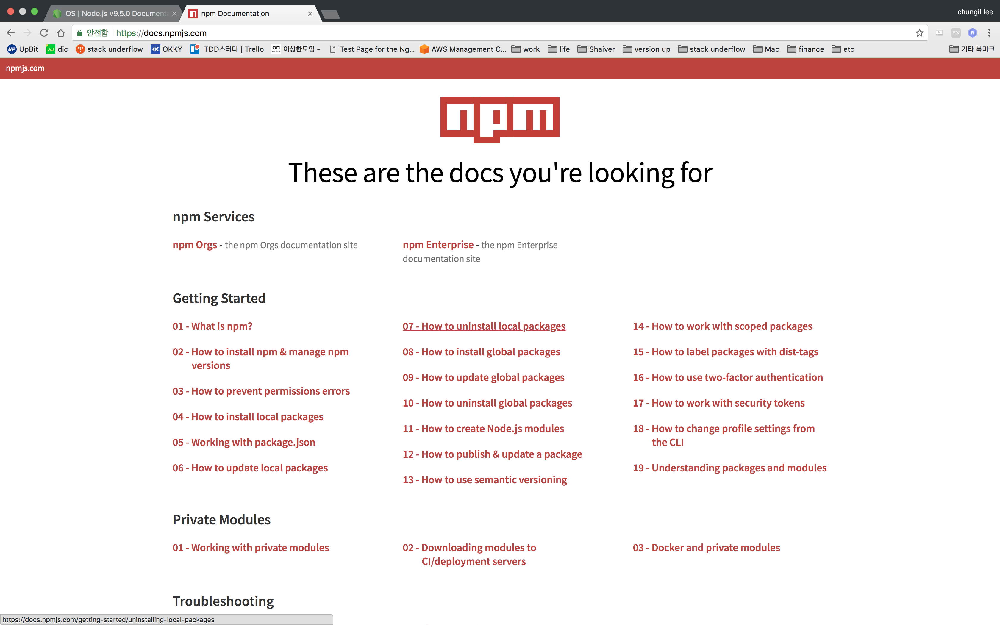
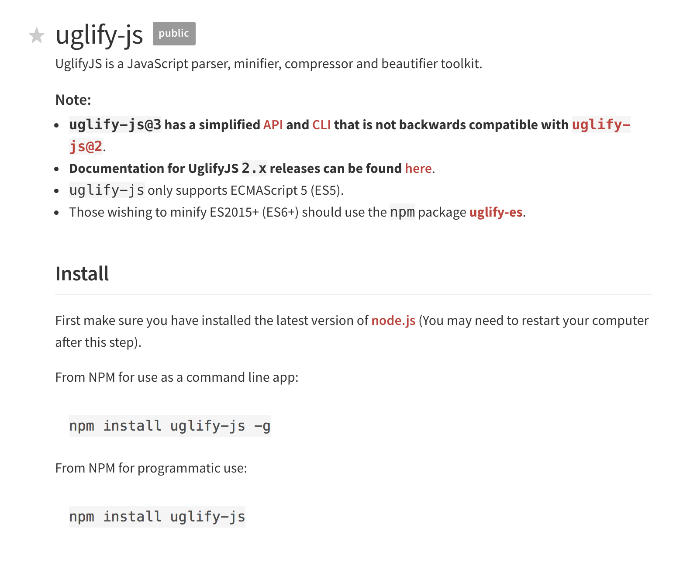

<h1>What is NPM</h1>

<h3> NPM : Node Package Manager

이전에 살펴봤던 <a style='blue'>HTTP</a>, <a style='blue'>OS</a> 등은 모두 Nodejs가 제공하는 모듈이었다.

이밖에도 우리가 흔히 사용하는 Date, String, Array와 같은 유명한 모듈들이 존재한다.
이는 JavaScript가 제공하는 모듈이다.

이와 같은 모듈들은 해당 모듈들을 제공해주는 환경기반하에서 사용이 가능하다

이처럼 Nodejs에 수많은 모듈들이 존재하고, 그 모듈들을 사용하는데 도움을 주는 것이 바로 NPM인 것이다.
NPM은 쉽게 말해, Node계의 앱스토어로 비유할 수 있다.

우리가 스마트폰 사용시 앱스토어에서 필요한 앱을 검색하여 설치해서 사용하듯,
우린 Nodejs의 특정 모듈이 필요할때 NPM을 통해 원하는 모듈을 제공받을 수 있다.
<a style='gray'>(설치 / 삭제 / 업그레이드 / 의존성관리)</a>



npm공식 홈페이지를 통해 필요한 모듈 및 패키지를 구할 수 있다.
메이븐을 사용해 봤다면 http://www.mvnrepository.com/ 와 비숫한 역할을 할 것이다.



우리는 먼저 uglify-js 라는 모듈을 사용해볼 것이다.
설치방법은 크게 두가지가 있는데,

```bash
    npm install uglify-js --g
    
    npm install uglify-js
```

여기서 --g 는 global. 즉, 설치한 PC전역에서 사용할 수 있는 public 한 개념으로 이해하면 될 것이고,
--g 가 없는 설치는 해당 모듈을 설치한 패키지 내에서만 private 하게 사용할 수 있게 되는 것이다.

